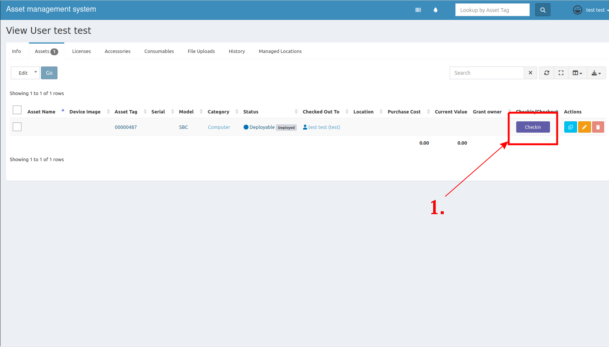
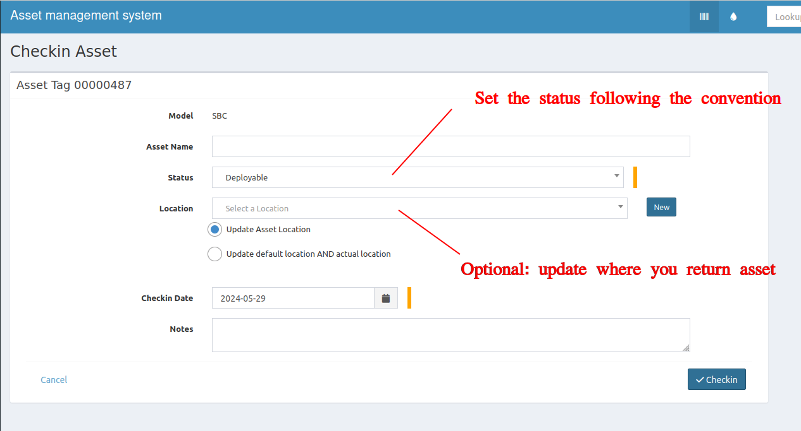

After you finish your work and want to return assets, you have to check them in. This includes if you want to let other people borrow items. To keep the data up to date, please strictly follow the check-in/check-out process **every time assets change owners!!**

## Checkin asset
1. At your asset page, click **Checkin** button.

2. Put these informations.
    - status
        - Deployable - This asset can now freely use.
        - Delivered - This asset was sent to other company.
        - Broken - This assest cannot be used, need to fix.
        - Missed - This assset cannot be used, and no longer can track where it is.

    - Location - (optional) Update where you return the asset; otherwise, it will be assumed that you returned it to the default location.

    