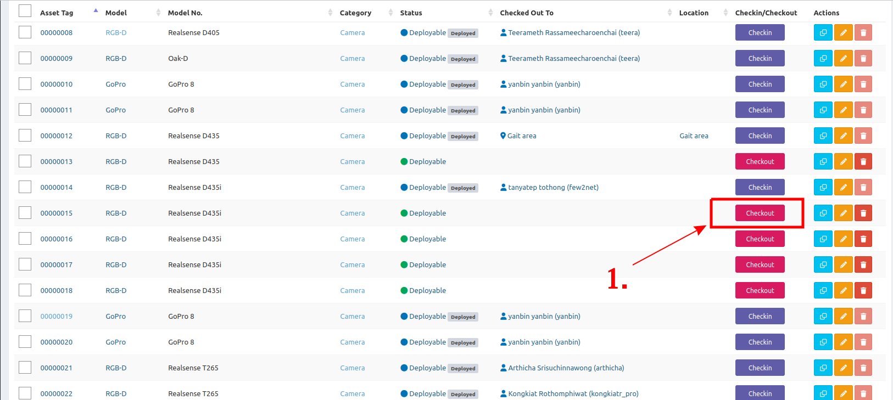
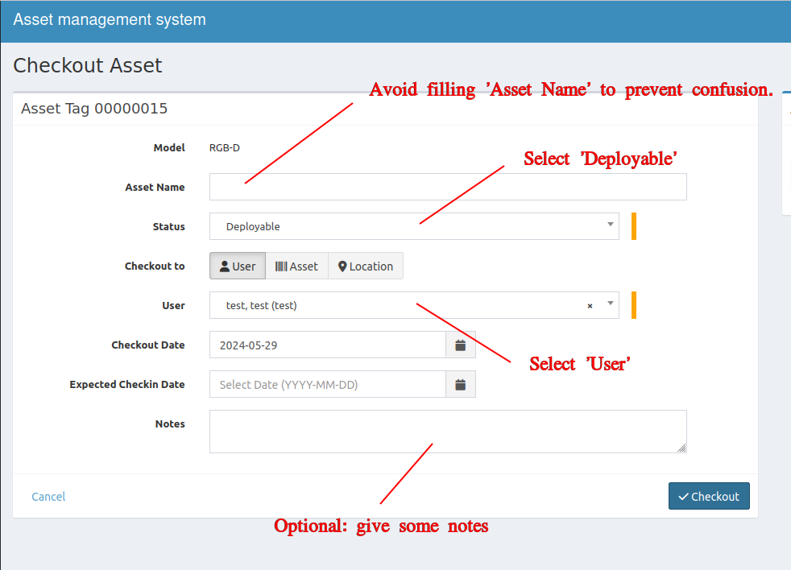

Follow the instructions below if you want to check out the lab's assets for these purposes:

- Personal usage, such as a mouse and keyboard.
- Fast prototyping or temporary testing, with plans to return it soon.
- Playground use.

## Checkout to User
1. At right side of the **Deployable** asset, click **Checkout**.

2. Put the informations
    - Asset Name - &#x2612; Avoid using this field to prevent confusion.
    - Status - select **'Deployable'**.
    - User - select your user name.
    - Notes - optional.
    
    