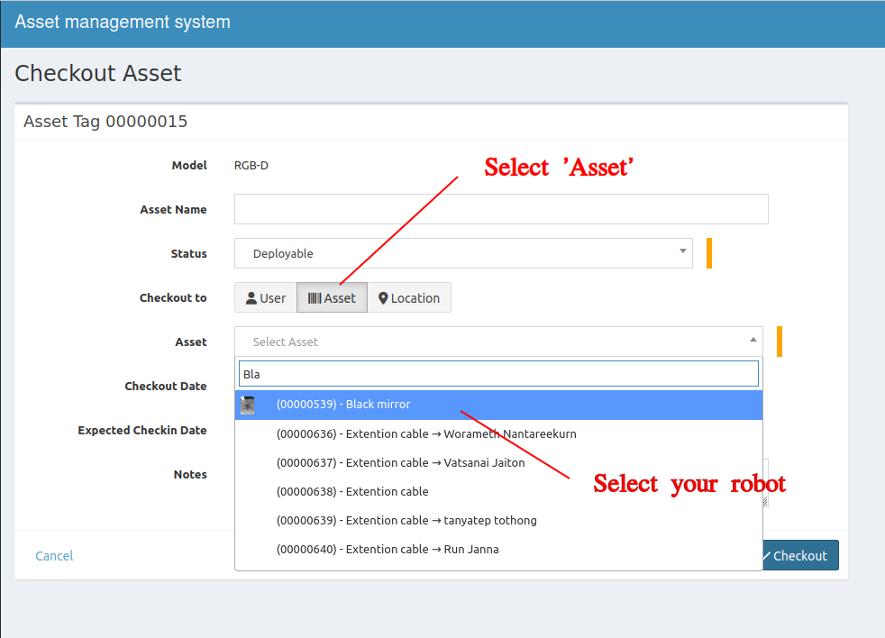

Follow the instructions below if you want to check out the lab's assets and attach them to the robot, which may be used for a long time or planned for delivery to an outside company.

## Checkout to Asset
1. Put the informations
    - Asset Name - &#x2612; Avoid using this field to prevent confusion.
    - Status - select **'Deployable'**.
    - Checkout to - select **'Asset'**
    - Asset - select your robot.
    - Notes - optional.
> If it doesn't has your robot yet, please follow **how to create robot** guide.

