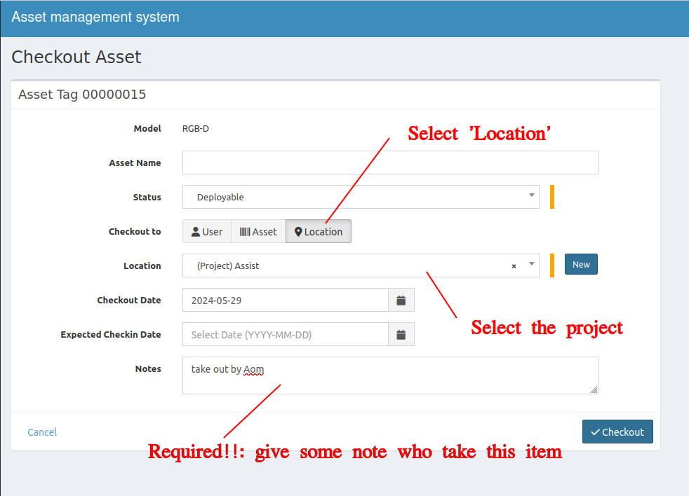

Follow the instructions below if you want to check out the lab's assets for a project, but they won't be attached directly to a robot.

## Checkout to Location
1. Put the informations
    - Asset Name - &#x2612; Avoid using this field to prevent confusion.
    - Status - select **'Deployable'**.
    - Checkout to - select **'Location'**
    - Location - select your project. Note that it is Location which has **(Project)** prefix.
    - Notes - **Now required**. For easier tracking who in project team is responsible for this asset.
> If it doesn't has your project yet, please follow **how to create project** guide.

Note!

- This method also helpful in moving objects to specific stations, e.g. Mocap, Gait station, WAI room, etc.
- For temporary members, such as internship students, you can also use this method and assign them to location **'Internship'**