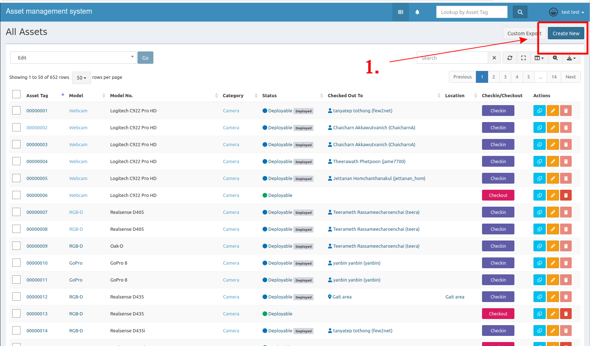
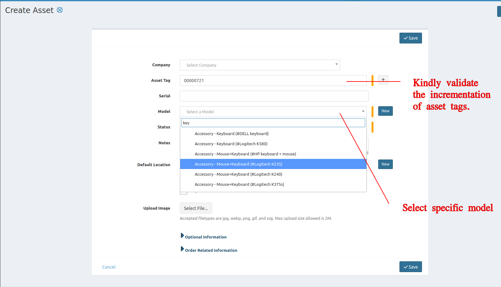
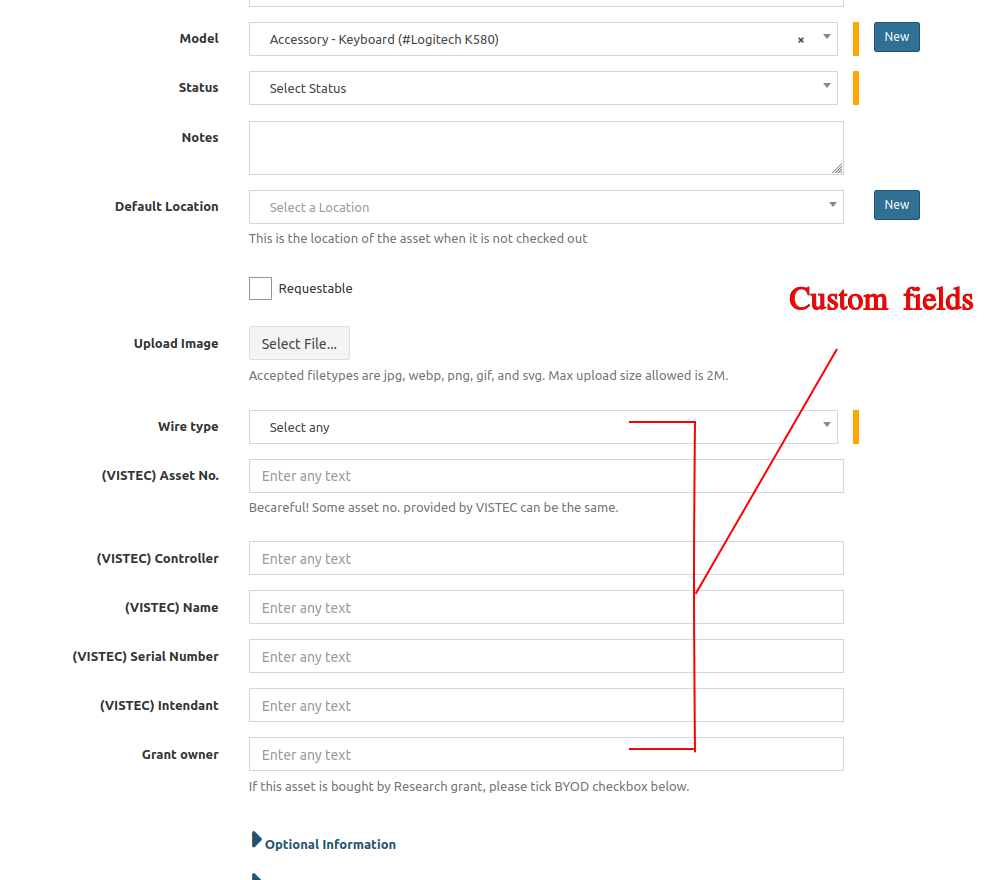
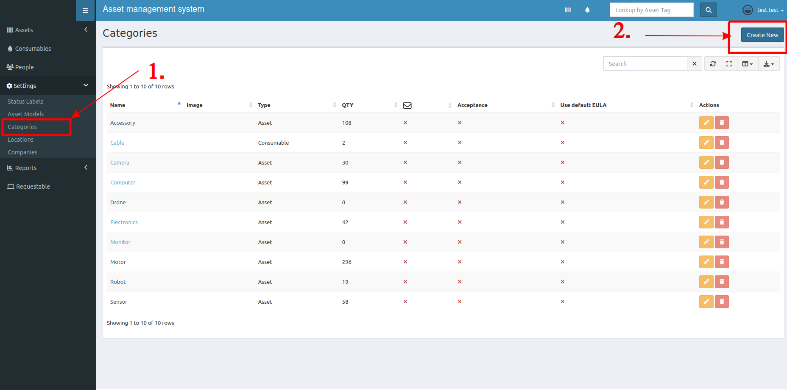
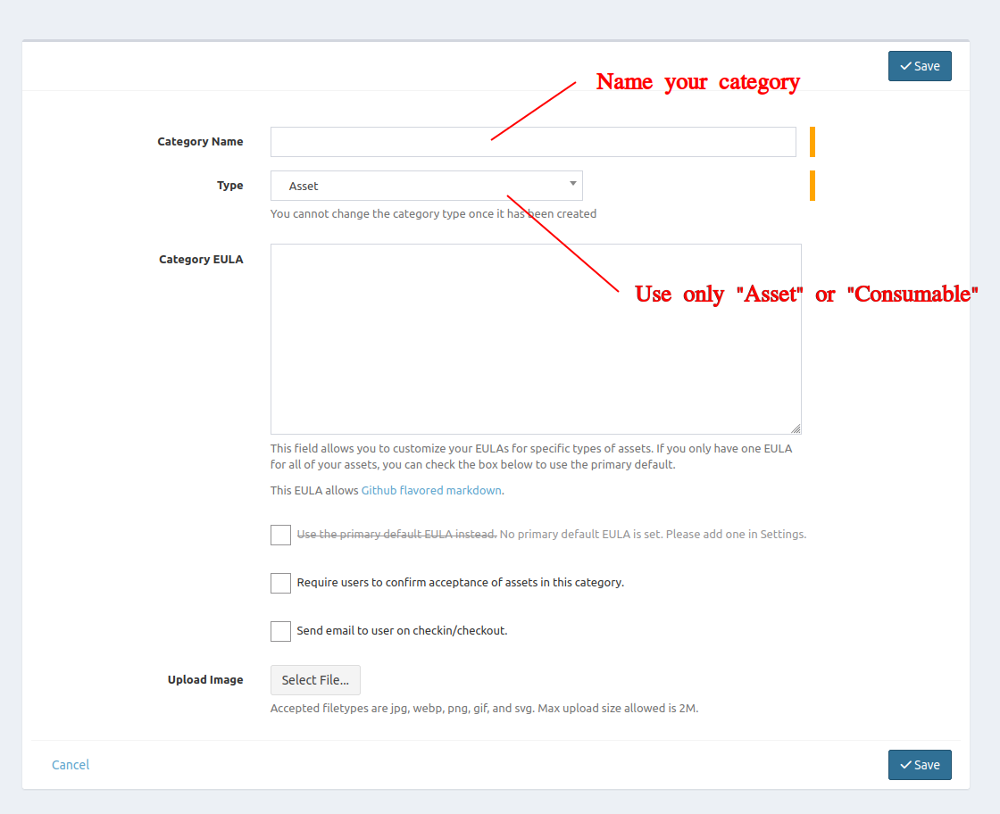
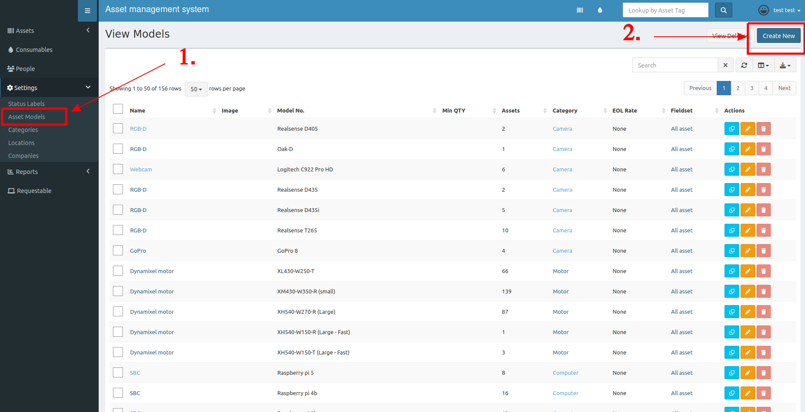
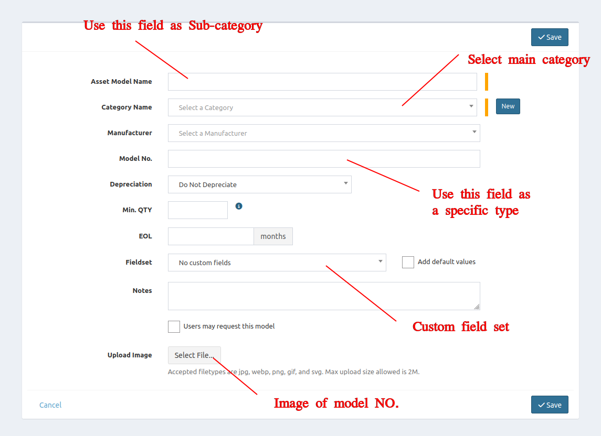

## Add new asset
1. At top right, click **Create New**

2. Put these informations.
    - Company - (Optional) which outside company you work with.
    - Asset Tag - Each asset has a unique ID. Normally, it will auto-increase and remain unique. However, sometimes the number may be abnormal, such as a jump in numbers or an incorrect format. Kindly recheck it by comparing it with existing data.
    - Serial - &#x2612; Avoid using this field to prevent confusion.
    - Model - Select the specific type of asset. Some categories or asset models may have inherited custom fields (For example, wire type of keyboard). Fill the information that best matches in your pracical usage.
    - Default location - (Optional) Place you can find this asset by default.
    
    

## Create new asset type
If your preferred asset model number does not appear when creating an asset, you can also create a new type using this way.

### Create new categories
1. At left side menu, click **Categories**.
2. At top right, click **Create New**.

3. Put these informations
    - Category Name - Name your new category.
    - Type - In our lab we only use **"Asset"** and **"Consumable"** 

### Create new asset model
1. At left side menu, click **Asset Models**.
2. At top right, click **Create New**.

3. Put these informations.
    - Asset Model Name - Name your new asset model, keep in mind that we use this field as a sub-category.
    - Category - Select main category of this asset model.
    - Model NO. - **REQUIRED!!** Put the specific type name of your asset model here.
    - Fieldset - (optional) Choose an inherited fieldset that will appear when a user adds a new asset.
    - Upload Image - (optional) Upload the asset model image.

> Example:
>
> - Asset Model Name -> *IMU*
> - Category Name -> *Sensor*
> - Model No. -> *Phidgets 1042_0B*