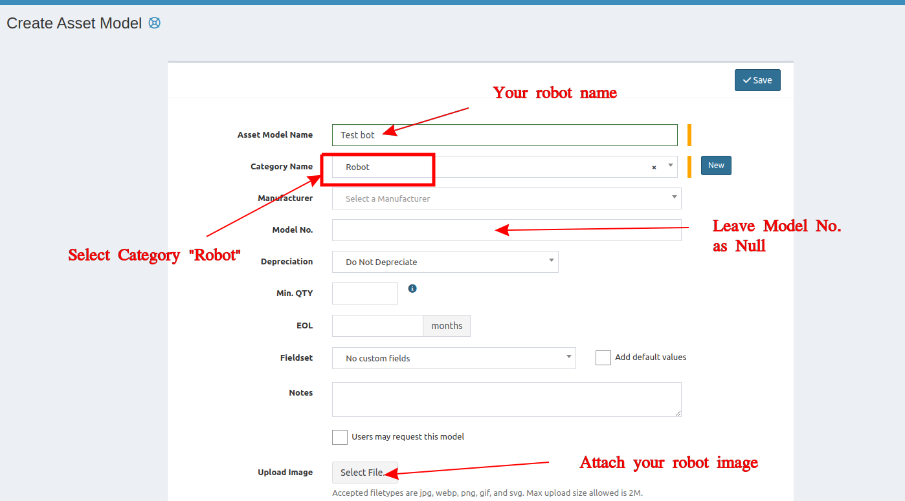
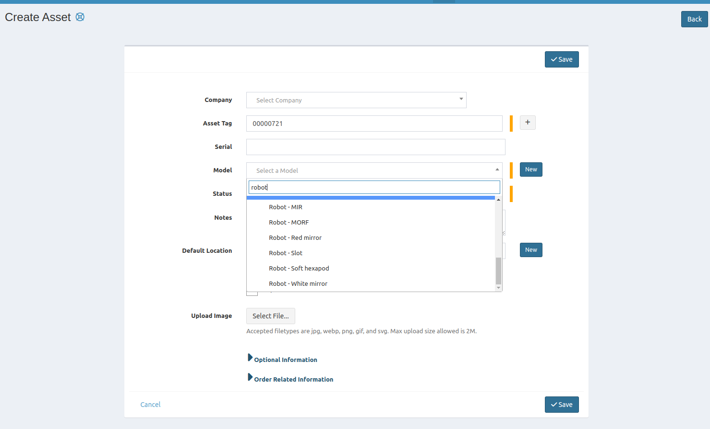

## Add new robot
1. The same as how to create asset model, put these informations.
    - Asset Model Name - your robot name
    - Category Name - Robot
    - Model No. - leave null

2. Now you can create new asset of that robot.
