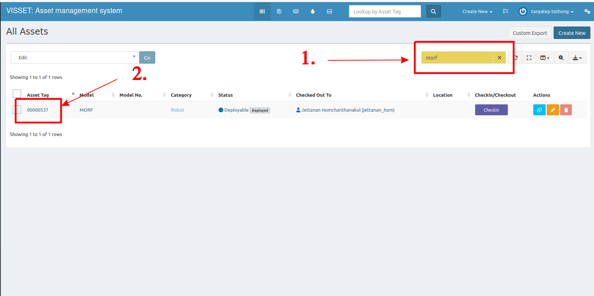
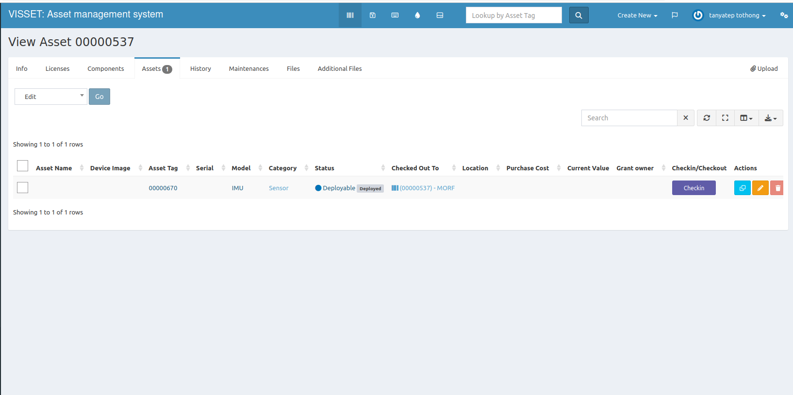
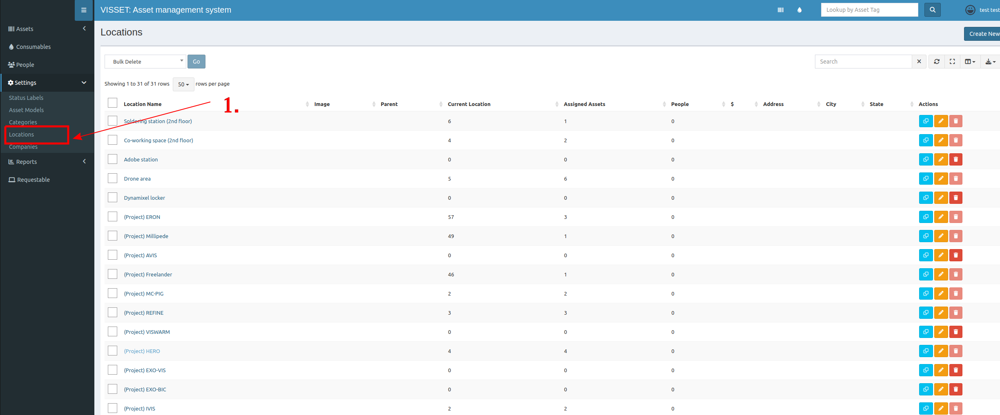
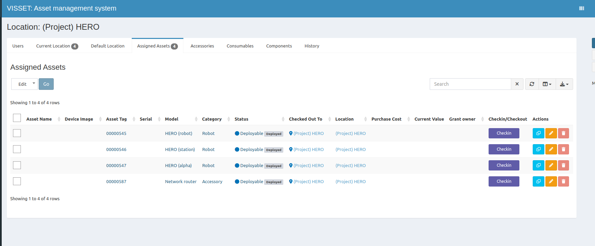

## Search robot's asset
1. Since we defined **"robot"** as an asset, you can search it at list all page.
2. Click on the asset tag, and you will see the assets assigned to that robot.

## Search project's asset
1. At left menu, click **Location**. Here you can see all projects (which have prefix **(Project)**).

2. Click on the project you want; it will show all assets and robots involved in this project.
