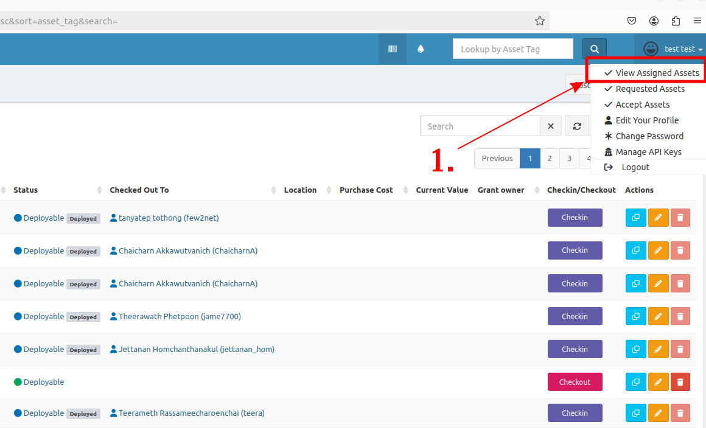
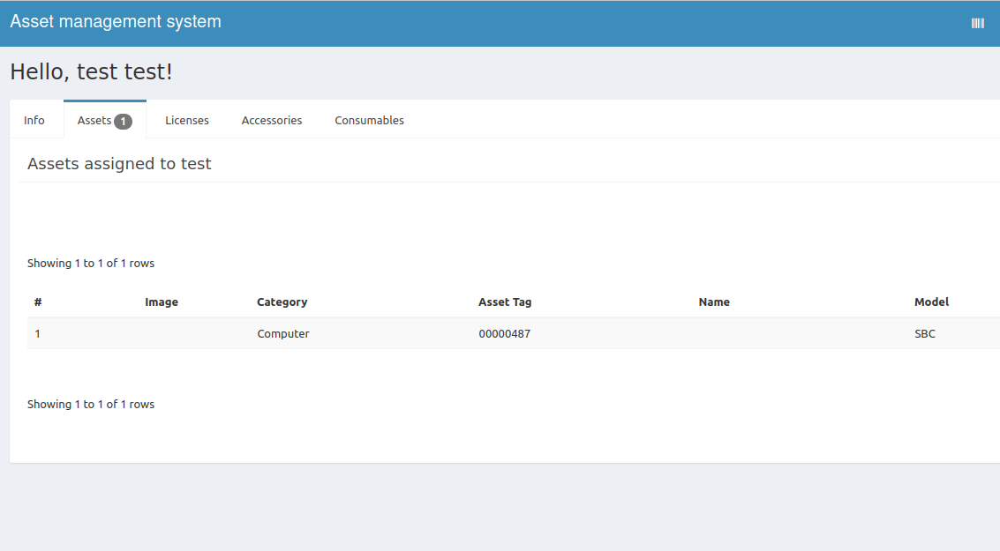
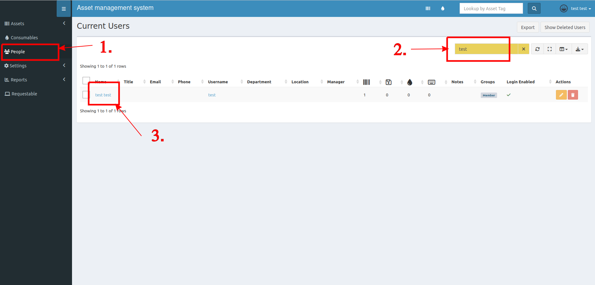
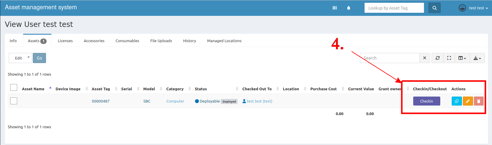

## Search via your profile
1. At your profile button, click **View Assigned Asset**

2. The result will show your assets.

> Note: This method cannot be used to see each asset's details due to a bug in the original repository. 
> If you want to check the details, please follow the instructions below.

## Search via people page
1. At left side menu, click **People**.
2. Search your name.
3. Click to see the assets belonging to each member.

4. By this way, you can easily manage your assets.

